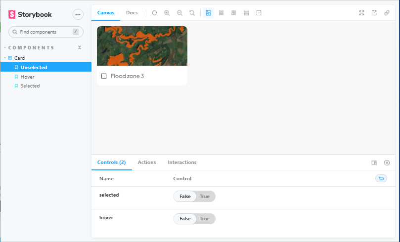
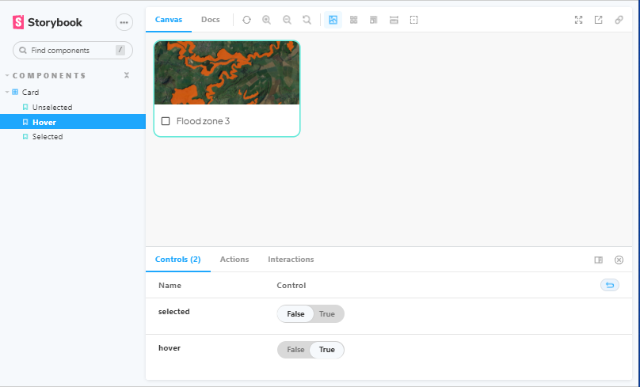
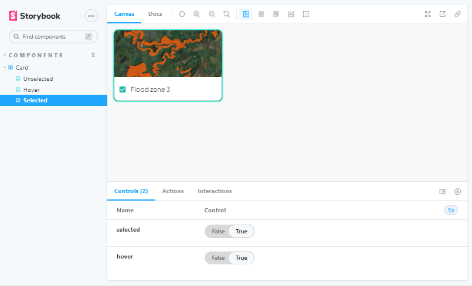

# Frontend Test

This is a test task to buid a Card component having different states using React, Material UI and Storybook.

## Screenshots

- Unselected
 

 - Hover
 

 - Selected
 

 ## How to View

 To view this project, clone the repo and run <code>npm install </code> to install the dependencies. When this is done, run the command <code>npm run storybook </code>. This starts up storybook on <code>http://localhost:6006/ </code> on your browser.